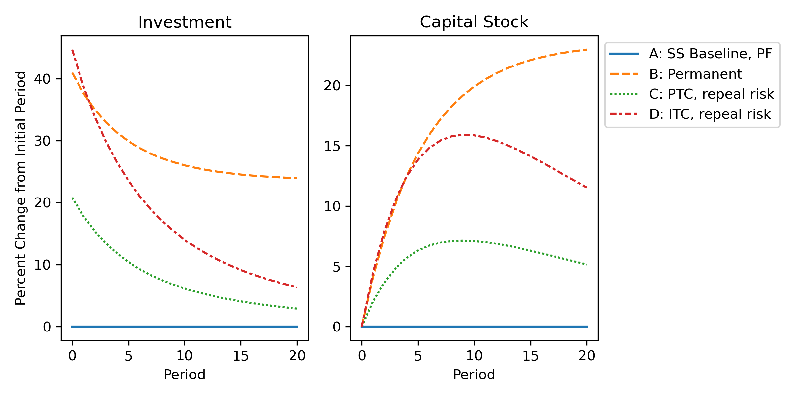

# Endogenous Price Results

Simulation results and figures for runs where price expectations are endogenous.

The figures are shown below under the identifying part of their names. Note that not all of the figures are used in the paper, and the order is different.

## 1

## 2

## 3

## 4

## 5

## 6

## 7

## 8

## 9

