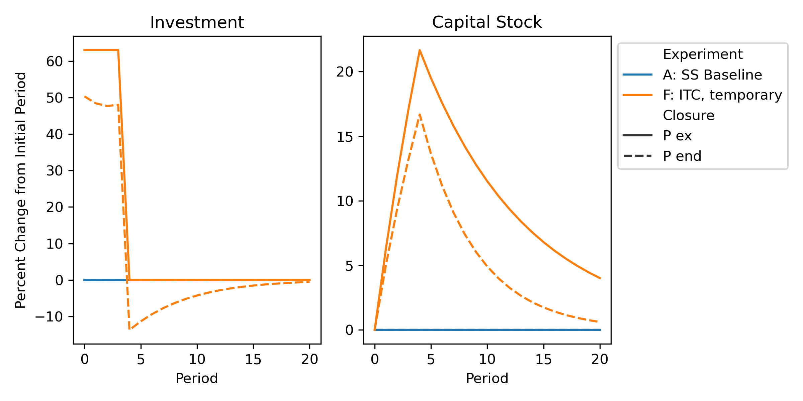

# Comparison Graphs

Figures comparing runs with exogenous and endogenous price expectations.

The figures are shown below under the identifying parts of their names. Note that not all of the figures are used in the paper, and the order is different.

## 1 AB

## 1 AC

## 1 AD

## 2 AG

## 2  AH

## 2 AI

## 2 AJ

## 3 AE

## 3 AF

## 3 AK

## 3 AL

## 4 AM

## 4 AN

## 4 AP

## 4 AQ

## 4 AR

